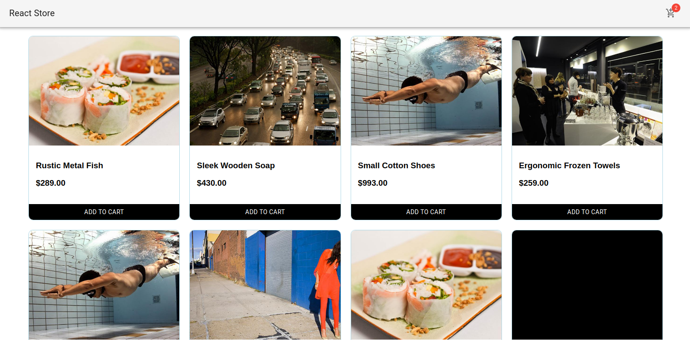

# Projeto de avaliação técnica Frontend

### React Store

## <a href="https://react-store-cart.netlify.app">DEMO</a>

## Quick start

Install:

```
git clone https://github.com/gabriel-cardoso-oliveira/react-store.git
```
```
cd react-store/
```
```
yarn install
```

Execute:

```
yarn start
```

<p align="center">
  
</p>
